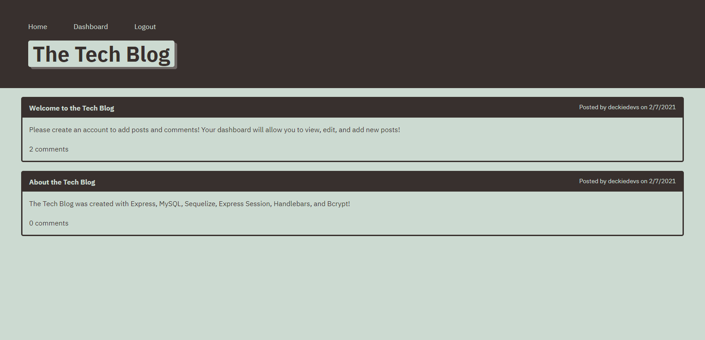
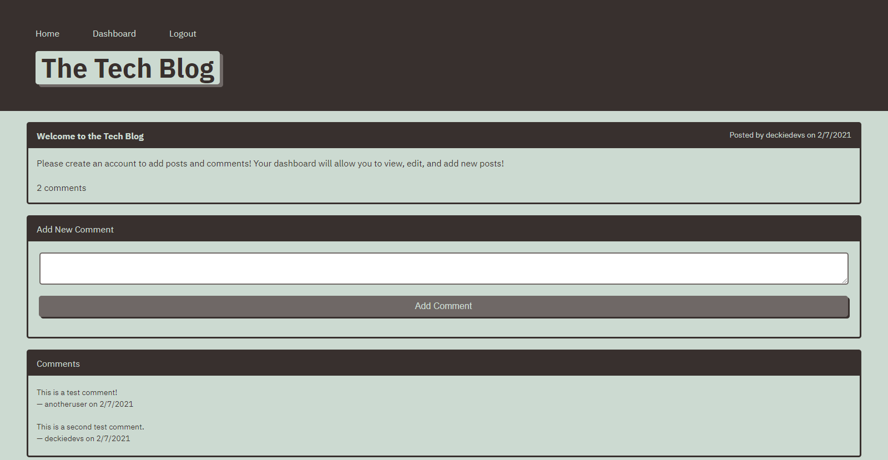
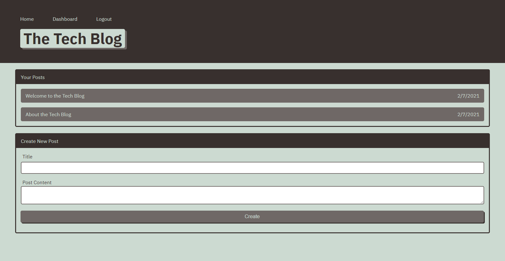
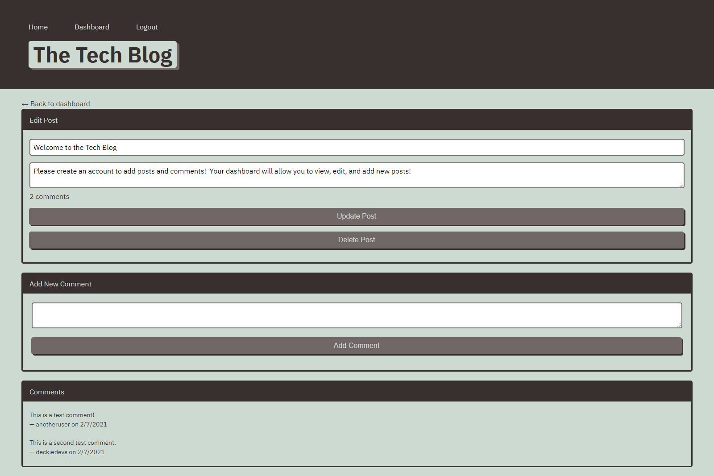

# The Tech Blog
  
  

## Description
Tech Blog is a full-stack RESTful application that allows users to create an account to write posts and comments.
            
View the deployed page at [Tech Blog](https://quiet-escarpment-26240.herokuapp.com/).
  

## Contents
* [Usage](#Usage)
   * [Screenshots](#Screenshots)
* [Technologies](#Technologies)
* [Questions](#Questions)
* [Contributions](#Contributions)
  

## Usage
Use the "Login" link to login to an existing account or create a new account.  Logged in users can post comments to existing posts or create new posts from their Dashboard.  Posts may also be edited and deleted from the dashboard. 
  

### Screenshots

All posts are available on the main page.
  

Logged in users can add a comment to a post.
  

Logged in users can add new posts from their dashboard.
  

Posts may also be edited or deleted.
  

## Technologies
* Node
* Express
* MySQL
* Sequelize
* Express Sessions
* Bcrypt
* Handlebars
  

## Questions
If you have any questions about the repo, please [open an issue](https://github.com/krutipatel07/MVC-TechBlog/issues) or contact me via email at kruti.patel0709@gmail.com. You can find more of my work on my GitHub, [krutipatel](https://github.com/krutipatel07/).
  

## Contributions
* Built with enthusiasm by Kruti Patel.